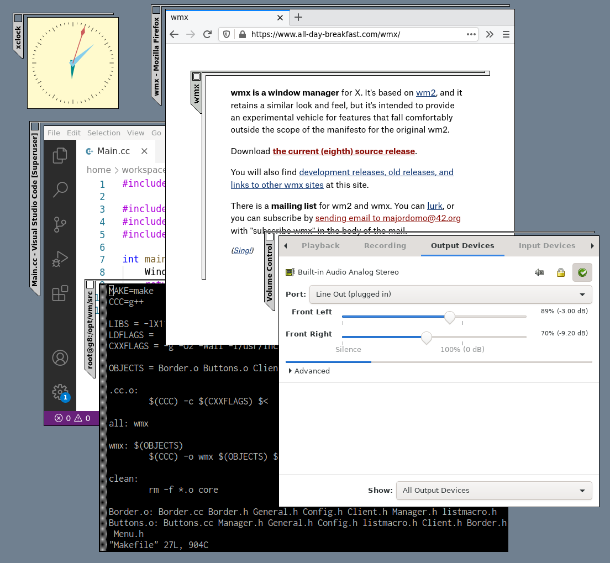

# wmx
wmx is a window manager for X. It looks like this 

This is a reduced version of wmx based on the latest (wmx-8) release from [https://www.all-day-breakfast.com/wmx/].
I've removed some of the options that I don't use as I'm hoping to try to convert the code to use xcb (or maybe to wayland).
